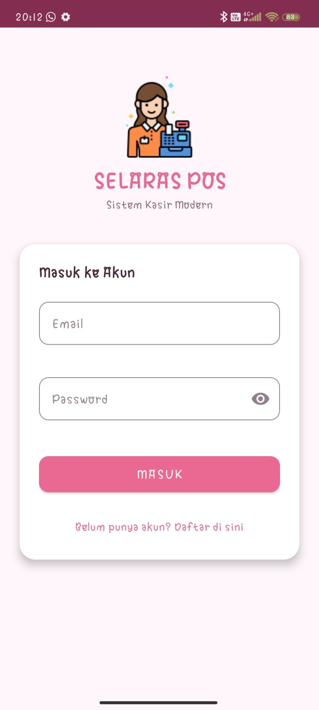
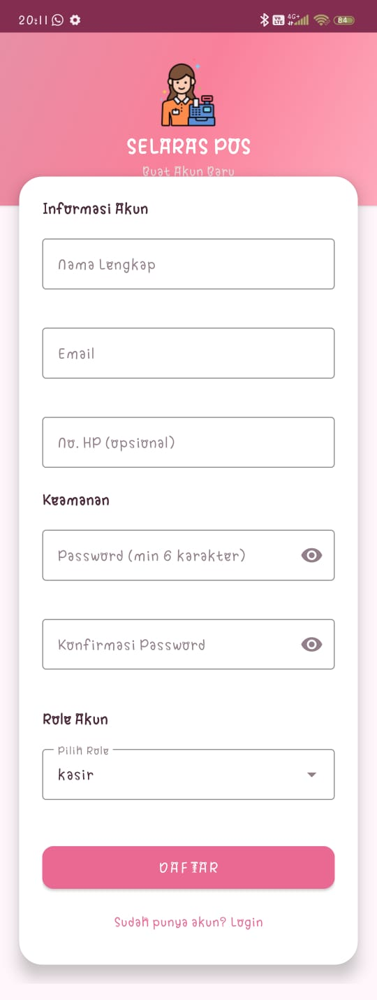
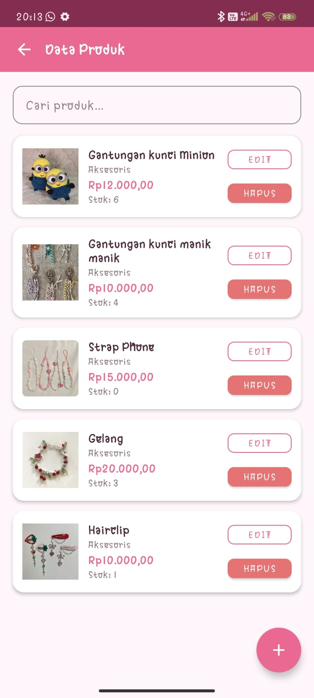
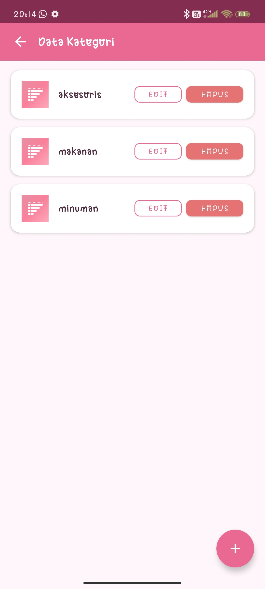
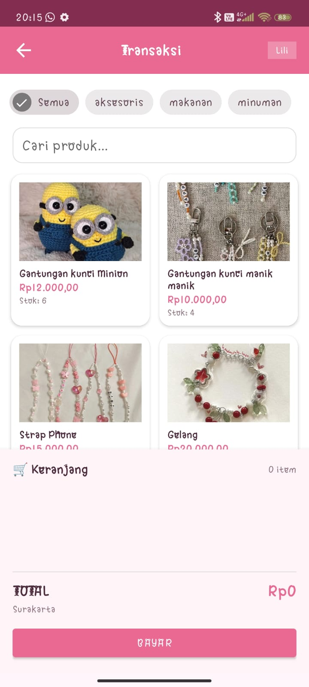
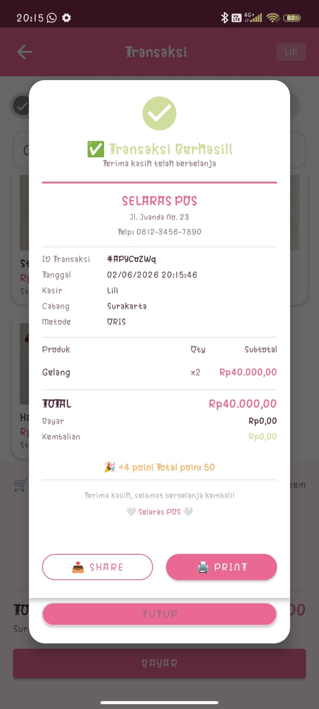
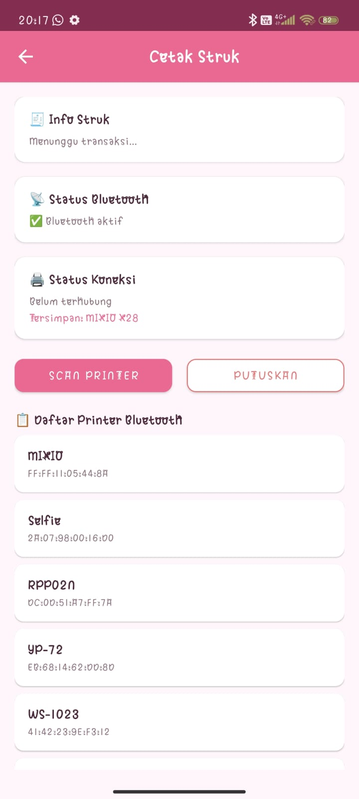
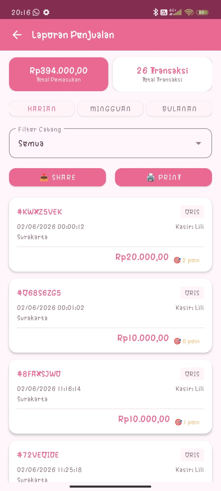
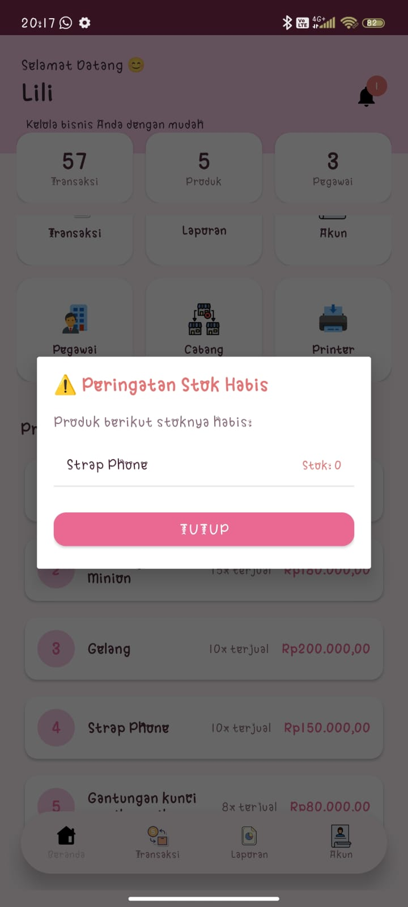

## 📱 Aplikasi Mobile-POS

Berikut adalah kumpulan tangkapan layar fitur yang terdapat pada aplikasi:

### 1. Autentikasi

  
  

### 2. Dashboard & Pengguna

  
  
  
  

### 3. Manajemen Data Master

  
  
  
  

  
  
  
  

  
  

### 4. Transaksi & Laporan

  
  
  
  

  
  

## Deskripsi Aplikasi Selaras POS

---

### 📱 **Selaras POS - Solusi Kasir Digital Modern untuk UMKM**

**Selaras POS** adalah aplikasi Point of Sale (POS) berbasis Android yang dirancang khusus untuk membantu pelaku UMKM dalam mengelola usaha mereka secara digital. Aplikasi ini menggantikan sistem kasir manual dengan solusi yang lebih cepat, akurat, dan terintegrasi.

---

### 🎯 **Tujuan dan Manfaat**

| Tujuan | Manfaat |
|--------|---------|
| **Mempermudah transaksi** | Proses checkout cepat dengan antarmuka yang intuitif |
| **Mengelola stok produk** | Pantau stok barang secara real-time |
| **Mencatat keuangan** | Laporan penjualan otomatis dan akurat |
| **Mengelola data pegawai** | Atur hak akses admin dan kasir |
| **Memudahkan pencetakan struk** | Cetak via Bluetooth tanpa ribet |

---

### 👥 **Siapa yang Membutuhkan?**

| Bidang Usaha | Contoh |
|--------------|--------|
| **Kafe & Restoran** | Kafe, rumah makan, coffee shop |
| **Toko Retail** | Toko kelontong, fashion, aksesoris |
| **Minimarket** | Toko sembako, convenience store |
| **Butik & Salon** | Butik pakaian, salon kecantikan |
| **UMKM Lainnya** | Bisnis skala kecil dan menengah |

---

### ✨ **Fitur Utama**

#### 1. **Manajemen Data**
- ✅ **Produk** - Tambah, edit, hapus produk dengan gambar
- ✅ **Kategori** - Kelompokkan produk berdasarkan jenis
- ✅ **Pegawai** - Kelola data pegawai + status aktif/tidak aktif
- ✅ **Cabang** - Kelola beberapa cabang toko
- ✅ **Pelanggan** - Data pelanggan terintegrasi

#### 2. **Transaksi POS**
- ✅ **Cari produk** - Filter berdasarkan nama
- ✅ **Filter kategori** - Pisahkan produk per kategori
- ✅ **Keranjang** - Tambah, kurangi, hapus item
- ✅ **Multi metode bayar** - Cash, QRIS, Transfer
- ✅ **Hitung kembalian** - Otomatis dan real-time
- ✅ **Cetak struk** - Print via Bluetooth
- ✅ **Share struk** - Kirim via WhatsApp/Email

#### 3. **Laporan**
- ✅ **Filter periode** - Harian, Mingguan, Bulanan
- ✅ **Filter cabang** - Per cabang atau semua
- ✅ **Total pemasukan** - Hitung otomatis
- ✅ **Share laporan** - Bagikan via WhatsApp/Email
- ✅ **Print laporan** - Cetak ke printer Bluetooth

#### 4. **Manajemen Pengguna**
- ✅ **Role Admin** - Akses penuh ke semua fitur
- ✅ **Role Kasir** - Hanya akses transaksi dan laporan
- ✅ **Profil akun** - Edit data diri

#### 5. **Tampilan**
- ✅ **Dark Mode** - Otomatis sesuai tema HP
- ✅ **Responsive** - Portrait & landscape
- ✅ **Material Design** - Modern dan nyaman

---

### 🛠️ **Teknologi yang Digunakan**

| Komponen | Teknologi | Keunggulan |
|----------|-----------|------------|
| **Frontend** | Kotlin | Modern, aman, performa tinggi |
| **UI/UX** | Material Design 3 | Tampilan cantik dan konsisten |
| **Database** | Firebase Realtime Database | Sinkronisasi real-time, tanpa server |
| **Auth** | Firebase Authentication | Keamanan akun terjamin |
| **Gambar** | Glide | Loading gambar cepat |
| **Print** | ESC/POS Bluetooth | Kompatibel dengan banyak printer |

---

### 📱 **Cara Penggunaan**

#### Untuk Admin:
1. **Login** dengan akun admin
2. **Setup awal**: tambah cabang → tambah kategori → tambah produk
3. **Tambah pegawai** untuk kasir
4. **Lakukan transaksi** atau pantau laporan

#### Untuk Kasir:
1. **Login** dengan akun kasir
2. **Pilih produk** → masukkan ke keranjang
3. **Pilih metode pembayaran** → input uang bayar
4. **Cetak atau share struk**

---

### 📊 **Statistik yang Dihasilkan**

| Laporan | Informasi |
|---------|-----------|
| Total pemasukan | Jumlah uang masuk dalam periode tertentu |
| Total transaksi | Jumlah transaksi yang terjadi |
| Detail transaksi | ID, tanggal, kasir, metode, total |
| Filter cabang | Pemasukan per cabang |

---

### 🔒 **Keamanan**

- ✅ **Firebase Authentication** - Login dengan email & password
- ✅ **Role-based access** - Hak akses berbeda untuk admin dan kasir
- ✅ **Data real-time** - Update otomatis tanpa reload
- ✅ **Cloud database** - Data aman di server Firebase

---

### 💰 **Keuntungan Menggunakan Selaras POS**

| Keuntungan | Penjelasan |
|------------|------------|
| **Gratis** | Tidak ada biaya lisensi atau langganan |
| **Offline support** | Bisa digunakan saat koneksi internet terbatas |
| **Cetak struk** | Bluetooth printer (thermal) kompatibel |
| **Cloud backup** | Data tersimpan aman di Firebase |
| **Multi cabang** | Kelola beberapa toko dalam satu akun |
| **Real-time** | Data langsung tersinkronisasi |

---

### 📝 **Kesimpulan**

**Selaras POS** adalah solusi kasir digital yang **mudah digunakan**, **gratis**, dan **fitur-lengkap** untuk UMKM. Dengan aplikasi ini, pemilik usaha dapat:

- ✅ Meningkatkan efisiensi transaksi
- ✅ Mengelola stok dan produk dengan mudah
- ✅ Memantau laporan penjualan secara real-time
- ✅ Menghemat biaya (gratis!)
- ✅ Meningkatkan profesionalisme usaha

---

